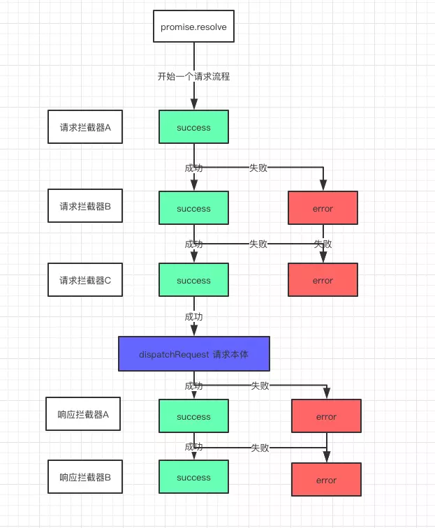

##### axios支持IE8+，但原理是基于promise之上实现的，因此会存在不兼容IE的问题。
##### 解决方案；
    （1）首先安装 babel-polyfill，来解决IE不支持 promise对象的问题；
    （2）安装成功以后需要在 main.js 中引入 babel-polyfill，一般会配置 webpack.base.config.js 中 entry；
##### axios在安卓低版本兼容性处理
##### 解决方案：
    （1）项目中安装 es6-promise；
    （2）引入 es6-promise；
    （3）注册 es6-promise (一定要在axios之前注册)；
##### 1、xhr.js
````js
// axios中浏览器端使用的请求函数
module.exports = function xhrAdapter(config) {
  return new Promise(function dispatchXhrRequest(resolve, reject) {
    var requestData = config.data;
    var requestHeaders = config.headers;

    //调用utils.js里的工具函数
    // 判断是否是FormData对象, 如果是, 删除header的Content-Type字段，让浏览器自动设置Content-Type字段
    if (utils.isFormData(requestData)) {
      delete requestHeaders['Content-Type']; // Let the browser set it
    }

    // 创建xtr对象
    var request = new XMLHttpRequest();

    // HTTP basic authentication
    // 设置http请求头中的Authorization字段
    // 关于Authorization字段
    if (config.auth) {
      var username = config.auth.username || '';
      var password = config.auth.password || '';
      // 使用btoa方法base64编码username和password
      requestHeaders.Authorization = 'Basic ' + btoa(username + ':' + password);
    }
    
    // 初始化请求方法
    // open(method: 请求的http方法, url: 请求的url地址, 是否支持异步)
    // 调用helpers/buildURL.js专门处理传入的参数
    request.open(config.method.toUpperCase(), buildURL(config.url, config.params, config.paramsSerializer), true);

    // Set the request timeout in MS
    // 设置超时时间
    request.timeout = config.timeout;

    // Listen for ready state
    // 监听readyState状态的变化，当readyState状态为4的时候，表示ajax请求成功
    request.onreadystatechange = function handleLoad() {
      if (!request || request.readyState !== 4) {
        return;
      }

      // The request errored out and we didn't get a response, this will be
      // handled by onerror instead
      // With one exception: request that using file: protocol, most browsers
      // will return status as 0 even though it's a successful request
       // request.status响应的数字状态码，在完成请求前数字状态码等于0
       // 如果request.status出错返回的也是0，但是file协议除外，status等于0也是一个成功的请求
      if (request.status === 0 && !(request.responseURL && request.responseURL.indexOf('file:') === 0)) {
        return;
      }

      // Prepare the response
      // getAllResponseHeaders方法会返回所有的响应头
      var responseHeaders = 'getAllResponseHeaders' in request ? parseHeaders(request.getAllResponseHeaders()) : null;
      // 如果没有设置数据响应类型（默认为“json”）或者responseType设置为text时，获取request.responseText值否则是获取request.response
      // responseType是一个枚举类型，手动设置返回数据的类型 更多请参考 https://developer.mozilla.org/zh-CN/docs/Web/API/XMLHttpRequest/responseType
      // responseText是全部后端的返回数据为纯文本的值 更多请参考 https://developer.mozilla.org/zh-CN/docs/Web/API/XMLHttpRequest/responseText
      // response为正文，response的类型取决于responseType 更多请参考 https://developer.mozilla.org/zh-CN/docs/Web/API/XMLHttpRequest/response
      var responseData = !config.responseType || config.responseType === 'text' ? request.responseText : request.response;
      var response = {
        data: responseData,
        status: request.status,
        statusText: request.statusText,
        headers: responseHeaders,
        config: config,
        request: request
      };

      // status >= 200 && status < 300 resolve
      // 否则reject
      settle(resolve, reject, response);

      // Clean up request
      request = null;
    };

    // Handle browser request cancellation (as opposed to a manual cancellation)
     // ajax中断时触发
    request.onabort = function handleAbort() {
      if (!request) {
        return;
      }

      reject(createError('Request aborted', config, 'ECONNABORTED', request));

      // Clean up request
      request = null;
    };

    // Handle low level network errors
    // ajax失败时触发
    request.onerror = function handleError() {
      // Real errors are hidden from us by the browser
      // onerror should only fire if it's a network error
      reject(createError('Network Error', config, null, request));

      // Clean up request
      request = null;
    };

    // Handle timeout
    // ajax请求超时时调用
    request.ontimeout = function handleTimeout() {
       // 抛出 timeout错误
      reject(createError('timeout of ' + config.timeout + 'ms exceeded', config, 'ECONNABORTED',
        request));

      // Clean up request
      request = null;
    };

    // Add xsrf header
    // This is only done if running in a standard browser environment.
    // Specifically not if we're in a web worker, or react-native.
    // 判断当前是为标准浏览器环境，如果是，添加xsrf头
    // 什么是xsrf header？ xsrf header是用来防御CSRF攻击
    // 原理是服务端生成一个XSRF-TOKEN，并保存到浏览器的cookie中，在每次请求中ajax都会将XSRF-TOKEN设置到request header中
    // 服务器会比较cookie中的XSRF-TOKEN与header中XSRF-TOKEN是否一致
    // 根据同源策略，非同源的网站无法读取修改本源的网站cookie，避免了伪造cookie
    if (utils.isStandardBrowserEnv()) {
      var cookies = require('./../helpers/cookies');

      // Add xsrf header
      var xsrfValue = (config.withCredentials || isURLSameOrigin(config.url)) && config.xsrfCookieName ?
      // 读取cookie中XSRF-TOKEN
        cookies.read(config.xsrfCookieName) :
        undefined;

      if (xsrfValue) {
        // 在request header中设置XSRF-TOKEN
        requestHeaders[config.xsrfHeaderName] = xsrfValue;
      }
    }

    // Add headers to the request
    // setRequestHeader是用来设置请求头部的方法
    if ('setRequestHeader' in request) {
      // 将config中配置的requestHeaders，循环设置到请求头上
      utils.forEach(requestHeaders, function setRequestHeader(val, key) {
        if (typeof requestData === 'undefined' && key.toLowerCase() === 'content-type') {
          // Remove Content-Type if data is undefined
          delete requestHeaders[key];
        } else {
          // Otherwise add header to the request
          request.setRequestHeader(key, val);
        }
      });
    }

    // Add withCredentials to request if needed
     // 设置xhr对象的withCredentials属性，是否允许cookie进行跨域请求
    if (config.withCredentials) {
      request.withCredentials = true;
    }

    // Add responseType to request if needed
     // 设置xhr对象的responseType属性
    if (config.responseType) {
      try {
        request.responseType = config.responseType;
      } catch (e) {
        // Expected DOMException thrown by browsers not compatible XMLHttpRequest Level 2.
        // But, this can be suppressed for 'json' type as it can be parsed by default 'transformResponse' function.
        if (config.responseType !== 'json') {
          throw e;
        }
      }
    }

    // Handle progress if needed
    // 下载进度
    if (typeof config.onDownloadProgress === 'function') {
      request.addEventListener('progress', config.onDownloadProgress);
    }

    // Not all browsers support upload events
    // 上传进度
    // request.upload XMLHttpRequest.upload 属性返回一个 XMLHttpRequestUpload对象，用来表示上传的进度
    if (typeof config.onUploadProgress === 'function' && request.upload) {
      request.upload.addEventListener('progress', config.onUploadProgress);
    }

    if (config.cancelToken) {
      // Handle cancellation
      // 取消请求，在介绍/lib/cancel/CancelToken.js中以及介绍，这里不在赘述
      config.cancelToken.promise.then(function onCanceled(cancel) {
        if (!request) {
          return;
        }

        request.abort();
        reject(cancel);
        // Clean up request
        request = null;
      });
    }

    if (requestData === undefined) {
      requestData = null;
    }

    // Send the request
    // 发送http请求
    request.send(requestData);
  });
};

````
##### 2、utils.js
````js
var toString = Object.prototype.toString;

/**
 * Determine if a value is an Array
 *
 * @param {Object} val The value to test
 * @returns {boolean} True if value is an Array, otherwise false
 */
function isArray(val) {
  return toString.call(val) === '[object Array]';
}

/**
 * Determine if a value is an ArrayBuffer
 *
 * @param {Object} val The value to test
 * @returns {boolean} True if value is an ArrayBuffer, otherwise false
 */
function isArrayBuffer(val) {
  return toString.call(val) === '[object ArrayBuffer]';
}

/**
 * Determine if a value is a FormData
 *
 * @param {Object} val The value to test
 * @returns {boolean} True if value is an FormData, otherwise false
 */
// 判断是否是formData对象
function isFormData(val) {
  return (typeof FormData !== 'undefined') && (val instanceof FormData);
}

/**
 * Determine if a value is a view on an ArrayBuffer
 *
 * @param {Object} val The value to test
 * @returns {boolean} True if value is a view on an ArrayBuffer, otherwise false
 */
function isArrayBufferView(val) {
  var result;
  if ((typeof ArrayBuffer !== 'undefined') && (ArrayBuffer.isView)) {
    result = ArrayBuffer.isView(val);
  } else {
    result = (val) && (val.buffer) && (val.buffer instanceof ArrayBuffer);
  }
  return result;
}

/**
 * Determine if a value is a String
 *
 * @param {Object} val The value to test
 * @returns {boolean} True if value is a String, otherwise false
 */
function isString(val) {
  return typeof val === 'string';
}

/**
 * Determine if a value is a Number
 *
 * @param {Object} val The value to test
 * @returns {boolean} True if value is a Number, otherwise false
 */
function isNumber(val) {
  return typeof val === 'number';
}

/**
 * Determine if a value is undefined
 *
 * @param {Object} val The value to test
 * @returns {boolean} True if the value is undefined, otherwise false
 */
// 判断是否为undefine
function isUndefined(val) {
  return typeof val === 'undefined';
}

/**
 * Determine if a value is an Object
 *
 * @param {Object} val The value to test
 * @returns {boolean} True if value is an Object, otherwise false
 */
function isObject(val) {
  return val !== null && typeof val === 'object';
}

/**
 * Determine if a value is a Date
 *
 * @param {Object} val The value to test
 * @returns {boolean} True if value is a Date, otherwise false
 */
function isDate(val) {
  return toString.call(val) === '[object Date]';
}

/**
 * Determine if a value is a File
 *
 * @param {Object} val The value to test
 * @returns {boolean} True if value is a File, otherwise false
 */
function isFile(val) {
  return toString.call(val) === '[object File]';
}

/**
 * Determine if a value is a Blob
 *
 * @param {Object} val The value to test
 * @returns {boolean} True if value is a Blob, otherwise false
 */
function isBlob(val) {
  return toString.call(val) === '[object Blob]';
}

/**
 * Determine if a value is a Function
 *
 * @param {Object} val The value to test
 * @returns {boolean} True if value is a Function, otherwise false
 */
function isFunction(val) {
  return toString.call(val) === '[object Function]';
}

/**
 * Determine if a value is a Stream
 *
 * @param {Object} val The value to test
 * @returns {boolean} True if value is a Stream, otherwise false
 */
function isStream(val) {
  return isObject(val) && isFunction(val.pipe);
}

/**
 * Determine if a value is a URLSearchParams object
 *
 * @param {Object} val The value to test
 * @returns {boolean} True if value is a URLSearchParams object, otherwise false
 */
// 判断是否为URLSearchParams对象
function isURLSearchParams(val) {
  return typeof URLSearchParams !== 'undefined' && val instanceof URLSearchParams;
}

/**
 * Trim excess whitespace off the beginning and end of a string
 *
 * @param {String} str The String to trim
 * @returns {String} The String freed of excess whitespace
 */
function trim(str) {
  return str.replace(/^\s*/, '').replace(/\s*$/, '');
}

/**
 * Determine if we're running in a standard browser environment
 *
 * This allows axios to run in a web worker, and react-native.
 * Both environments support XMLHttpRequest, but not fully standard globals.
 *
 * web workers:
 *  typeof window -> undefined
 *  typeof document -> undefined
 *
 * react-native:
 *  navigator.product -> 'ReactNative'
 * nativescript
 *  navigator.product -> 'NativeScript' or 'NS'
 */
// 判断当前环境是否为标准浏览器环境
function isStandardBrowserEnv() {
  if (typeof navigator !== 'undefined' && (navigator.product === 'ReactNative' ||
                                           navigator.product === 'NativeScript' ||
                                           navigator.product === 'NS')) {
    return false;
  }
  return (
    typeof window !== 'undefined' &&
    typeof document !== 'undefined'
  );
}

/**
 * Iterate over an Array or an Object invoking a function for each item.
 *
 * If `obj` is an Array callback will be called passing
 * the value, index, and complete array for each item.
 *
 * If 'obj' is an Object callback will be called passing
 * the value, key, and complete object for each property.
 *
 * @param {Object|Array} obj The object to iterate
 * @param {Function} fn The callback to invoke for each item
 */
function forEach(obj, fn) {
  // Don't bother if no value provided
  if (obj === null || typeof obj === 'undefined') {
    return;
  }

  // Force an array if not already something iterable
  if (typeof obj !== 'object') {
    /*eslint no-param-reassign:0*/
    obj = [obj];
  }

  if (isArray(obj)) {
    // Iterate over array values
    for (var i = 0, l = obj.length; i < l; i++) {
      fn.call(null, obj[i], i, obj);
    }
  } else {
    // Iterate over object keys
    for (var key in obj) {
      if (Object.prototype.hasOwnProperty.call(obj, key)) {
        fn.call(null, obj[key], key, obj);
      }
    }
  }
}

/**
 * Accepts varargs expecting each argument to be an object, then
 * immutably merges the properties of each object and returns result.
 *
 * When multiple objects contain the same key the later object in
 * the arguments list will take precedence.
 *
 * Example:
 *
 * ```js
 * var result = merge({foo: 123}, {foo: 456});
 * console.log(result.foo); // outputs 456
 * ```
 *
 * @param {Object} obj1 Object to merge
 * @returns {Object} Result of all merge properties
 */
function merge(/* obj1, obj2, obj3, ... */) {
  var result = {};
  function assignValue(val, key) {
    if (typeof result[key] === 'object' && typeof val === 'object') {
      result[key] = merge(result[key], val);
    } else {
      result[key] = val;
    }
  }

  for (var i = 0, l = arguments.length; i < l; i++) {
    forEach(arguments[i], assignValue);
  }
  return result;
}

/**
 * Function equal to merge with the difference being that no reference
 * to original objects is kept.
 *
 * @see merge
 * @param {Object} obj1 Object to merge
 * @returns {Object} Result of all merge properties
 */
function deepMerge(/* obj1, obj2, obj3, ... */) {
  var result = {};
  function assignValue(val, key) {
    if (typeof result[key] === 'object' && typeof val === 'object') {
      result[key] = deepMerge(result[key], val);
    } else if (typeof val === 'object') {
      result[key] = deepMerge({}, val);
    } else {
      result[key] = val;
    }
  }

  for (var i = 0, l = arguments.length; i < l; i++) {
    forEach(arguments[i], assignValue);
  }
  return result;
}

/**
 * Extends object a by mutably adding to it the properties of object b.
 *
 * @param {Object} a The object to be extended
 * @param {Object} b The object to copy properties from
 * @param {Object} thisArg The object to bind function to
 * @return {Object} The resulting value of object a
 */
function extend(a, b, thisArg) {
  forEach(b, function assignValue(val, key) {
    if (thisArg && typeof val === 'function') {
      a[key] = bind(val, thisArg);
    } else {
      a[key] = val;
    }
  });
  return a;
}
````
##### 3、buildURL.js
````js
function encode(val) {
  return encodeURIComponent(val).
    replace(/%40/gi, '@').
    replace(/%3A/gi, ':').
    replace(/%24/g, '$').
    replace(/%2C/gi, ',').
    replace(/%20/g, '+').
    replace(/%5B/gi, '[').
    replace(/%5D/gi, ']');
}

/**
 * Build a URL by appending params to the end
 *
 * @param {string} url The base of the url (e.g., http://www.google.com)
 * @param {object} [params] The params to be appended
 * @returns {string} The formatted url
 */
// 处理params参数
module.exports = function buildURL(url, params, paramsSerializer) {
  /*eslint no-param-reassign:0*/
  if (!params) {
    return url;
  }

  var serializedParams;
  if (paramsSerializer) {
    serializedParams = paramsSerializer(params);
  } else if (utils.isURLSearchParams(params)) {
    serializedParams = params.toString();
  } else {
    var parts = [];

    utils.forEach(params, function serialize(val, key) {
      if (val === null || typeof val === 'undefined') {
        return;
      }

      if (utils.isArray(val)) {
        key = key + '[]';
      } else {
        val = [val];
      }

      utils.forEach(val, function parseValue(v) {
        if (utils.isDate(v)) {
          v = v.toISOString();
        } else if (utils.isObject(v)) {
          v = JSON.stringify(v);
        }
        parts.push(encode(key) + '=' + encode(v));
      });
    });

    serializedParams = parts.join('&');
  }

  if (serializedParams) {
    var hashmarkIndex = url.indexOf('#');
    if (hashmarkIndex !== -1) {
      url = url.slice(0, hashmarkIndex);
    }

    url += (url.indexOf('?') === -1 ? '?' : '&') + serializedParams;
  }

  return url;
};

````
##### 4、Axios.js

````js
/**
 * Create a new instance of Axios
 *
 * @param {Object} instanceConfig The default config for the instance
 */
function Axios(instanceConfig) {
  // Axios的配置
  this.defaults = instanceConfig;
  // 拦截器
  this.interceptors = {
    request: new InterceptorManager(),// 请求拦截器
    response: new InterceptorManager() // 响应拦截器
  };
}

/**
 * Dispatch a request
 *
 * @param {Object} config The config specific for this request (merged with this.defaults)
 */
Axios.prototype.request = function request(config) {
  /*eslint no-param-reassign:0*/
  // Allow for axios('example/url'[, config]) a la fetch API
   // 如果config是一个字符串，把字符串当作请求的url地址
  if (typeof config === 'string') {
    config = arguments[1] || {};
    config.url = arguments[0];
  } else {
    config = config || {};
  }

    // 合并配置
  config = mergeConfig(this.defaults, config);
  // 如果没有指定请求方法，使用get方法
  config.method = config.method ? config.method.toLowerCase() : 'get';

  // Hook up interceptors middleware
  // 将请求拦截器，和响应拦截器，以及实际的请求（dispatchRequest）的方法组合成数组，类似如下的结构
  // [请求拦截器1success, 请求拦截器1error, 请求拦截器2success, 请求拦截器2error, dispatchRequest, undefined, 响应拦截器1success, 响应拦截器1error]
  
  var chain = [dispatchRequest, undefined];
  var promise = Promise.resolve(config);

  this.interceptors.request.forEach(function unshiftRequestInterceptors(interceptor) {
    chain.unshift(interceptor.fulfilled, interceptor.rejected);
  });

  this.interceptors.response.forEach(function pushResponseInterceptors(interceptor) {
    chain.push(interceptor.fulfilled, interceptor.rejected);
  });
  
  // 开始执行整个请求流程（请求拦截器->dispatchRequest->响应拦截器）
  // 流程可以理解为上图
  while (chain.length) {
    promise = promise.then(chain.shift(), chain.shift());
  }

  return promise;
};

Axios.prototype.getUri = function getUri(config) {
  config = mergeConfig(this.defaults, config);
  return buildURL(config.url, config.params, config.paramsSerializer).replace(/^\?/, '');
};

// Provide aliases for supported request methods
// 基于Axios.prototype.request封装其他方法
// 将delete，get，head，options，post，put，patch添加到Axios.prototype的原型链上
// Axios.prototype.delete =
// Axios.prototype.get =
// Axios.prototype.head =
// Axios.prototype.options =
// ...
utils.forEach(['delete', 'get', 'head', 'options'], function forEachMethodNoData(method) {
  /*eslint func-names:0*/
  Axios.prototype[method] = function(url, config) {
    return this.request(utils.merge(config || {}, {
      method: method,
      url: url
    }));
  };
});

utils.forEach(['post', 'put', 'patch'], function forEachMethodWithData(method) {
  /*eslint func-names:0*/
  Axios.prototype[method] = function(url, data, config) {
    return this.request(utils.merge(config || {}, {
      method: method,
      url: url,
      data: data
    }));
  };
});

module.exports = Axios;
````
##### 5、axios.js
````js
// 创建axios实例
function createInstance(defaultConfig) {
  var context = new Axios(defaultConfig);
  var instance = bind(Axios.prototype.request, context);

  // Copy axios.prototype to instance
  // 更改Axios.prototype.request的this，执行context实例
  // instance等于Axios.prototype.request方法
  utils.extend(instance, Axios.prototype, context);

  // Copy context to instance
  utils.extend(instance, context);

  return instance;
}

// Create the default instance to be exported
// axios会直接对使用者暴露一个axios.request的方法，所以我们在使用axios的时候可以这样使用。不需要new一个axios的实例
// import axios from 'axios'
// axios.get('/info')
var axios = createInstance(defaults);

// Expose Axios class to allow class inheritance
axios.Axios = Axios;

// Factory for creating new instances
// axios.create可以根据用户自定义的config生成一个新的axios实例
axios.create = function create(instanceConfig) {
  return createInstance(mergeConfig(axios.defaults, instanceConfig));
};

// Expose Cancel & CancelToken
axios.Cancel = require('./cancel/Cancel');
axios.CancelToken = require('./cancel/CancelToken');
axios.isCancel = require('./cancel/isCancel');

// Expose all/spread
axios.all = function all(promises) {
  return Promise.all(promises);
};
axios.spread = require('./helpers/spread');

module.exports = axios;

// Allow use of default import syntax in TypeScript
module.exports.default = axios;
````
##### 6、defaults.js
````js
// 默认Content-Type
var DEFAULT_CONTENT_TYPE = {
  'Content-Type': 'application/x-www-form-urlencoded'
};

// 设置ContentType，在没有设置的情况下
function setContentTypeIfUnset(headers, value) {
  if (!utils.isUndefined(headers) && utils.isUndefined(headers['Content-Type'])) {
    headers['Content-Type'] = value;
  }
}

// 根据当前环境，获取默认的请求方法
function getDefaultAdapter() {
  var adapter;
  // Only Node.JS has a process variable that is of [[Class]] process
  // 判断当前环境是否存在process对象
  if (typeof process !== 'undefined' && Object.prototype.toString.call(process) === '[object process]') {
    // For node use HTTP adapter
     // node环境
    adapter = require('./adapters/http');
  } else if (typeof XMLHttpRequest !== 'undefined') {
    // For browsers use XHR adapter
     // 浏览器环境
    adapter = require('./adapters/xhr');
  }
  return adapter;
}

var defaults = {
  // 默认的请求方法
  adapter: getDefaultAdapter(),

  // 格式化请求requestData，这会请求发送前使用
  transformRequest: [function transformRequest(data, headers) {
    // 格式化header属性名，将header中不标准的属性名，格式化为Accept属性名
    normalizeHeaderName(headers, 'Accept');
    // 格式化header属性名，将header中不标准的属性名，格式化为Content-Type属性名
    normalizeHeaderName(headers, 'Content-Type');
    
    if (utils.isFormData(data) ||
      utils.isArrayBuffer(data) ||
      utils.isBuffer(data) ||
      utils.isStream(data) ||
      utils.isFile(data) ||
      utils.isBlob(data)
    ) {
      return data;
    }
    if (utils.isArrayBufferView(data)) {
      return data.buffer;
    }
    // URLSearchParams提供了一些用来处理URL查询字符串接口
    // 如果是URLSearchParams对象
    if (utils.isURLSearchParams(data)) {
      // Content-Type设置为application/x-www-form-urlencoded
      // application/x-www-form-urlencoded，数据被编码成以&分隔的键值对
      setContentTypeIfUnset(headers, 'application/x-www-form-urlencoded;charset=utf-8');
      return data.toString();
    }
    // 如果是对象
    if (utils.isObject(data)) {
      // Content-Type设置为application/json
      setContentTypeIfUnset(headers, 'application/json;charset=utf-8');
      // 将请求正文格式化为JSON字符串，并返回
      return JSON.stringify(data);
    }
    return data;
  }],
  
  // 格式化响应resposeData，这会响应接受后使用
  transformResponse: [function transformResponse(data) {
    /*eslint no-param-reassign:0*/
    if (typeof data === 'string') {
      try {
        data = JSON.parse(data);
      } catch (e) { /* Ignore */ }
    }
    return data;
  }],

  /**
   * A timeout in milliseconds to abort a request. If set to 0 (default) a
   * timeout is not created.
   */
  // 默认超时时间
  timeout: 0,
  
  // xsrf设置的cookie的key
  xsrfCookieName: 'XSRF-TOKEN',
  // xsrf设置header的key
  xsrfHeaderName: 'X-XSRF-TOKEN',

  maxContentLength: -1,
  
  // 验证请求的状态
  // 在处理请求的Promise会被使用
  validateStatus: function validateStatus(status) {
    return status >= 200 && status < 300;
  }
};

defaults.headers = {
  common: {
    'Accept': 'application/json, text/plain, */*'
  }
};

utils.forEach(['delete', 'get', 'head'], function forEachMethodNoData(method) {
  defaults.headers[method] = {};
});

// 为post，put，patch请求设置默认的Content-Type
utils.forEach(['post', 'put', 'patch'], function forEachMethodWithData(method) {
  defaults.headers[method] = utils.merge(DEFAULT_CONTENT_TYPE);
});

module.exports = defaults;
````
##### 7、InterceptorManager.js
````js
// 拦截器类
function InterceptorManager() {
  // handlers数组用来存储拦截器
  this.handlers = [];
}

/**
 * Add a new interceptor to the stack
 *
 * @param {Function} fulfilled The function to handle `then` for a `Promise`
 * @param {Function} rejected The function to handle `reject` for a `Promise`
 *
 * @return {Number} An ID used to remove interceptor later
 */
// 添加拦截器，use方法接收两个参数，成功的回调以及失败的回调
InterceptorManager.prototype.use = function use(fulfilled, rejected) {
  this.handlers.push({
    // 成功的回调
    fulfilled: fulfilled,
    // 失败的回调
    rejected: rejected
  });
  return this.handlers.length - 1;
};

/**
 * Remove an interceptor from the stack
 *
 * @param {Number} id The ID that was returned by `use`
 */
// 根据id(索引)，删除实例handlers属性中拦截器
InterceptorManager.prototype.eject = function eject(id) {
  if (this.handlers[id]) {
    this.handlers[id] = null;
  }
};

/**
 * Iterate over all the registered interceptors
 *
 * This method is particularly useful for skipping over any
 * interceptors that may have become `null` calling `eject`.
 *
 * @param {Function} fn The function to call for each interceptor
 */
// 循环拦截器
InterceptorManager.prototype.forEach = function forEach(fn) {
  utils.forEach(this.handlers, function forEachHandler(h) {
    if (h !== null) {
      fn(h);
    }
  });
};

module.exports = InterceptorManager;
````
##### 8、dispatchRequest.js
````js
/**
 * Throws a `Cancel` if cancellation has been requested.
 */
// 判断请求是否已被取消，如果已经被取消，抛出已取消
function throwIfCancellationRequested(config) {
  if (config.cancelToken) {
    config.cancelToken.throwIfRequested();
  }
}

/**
 * Dispatch a request to the server using the configured adapter.
 *
 * @param {object} config The config that is to be used for the request
 * @returns {Promise} The Promise to be fulfilled
 */
module.exports = function dispatchRequest(config) {
  throwIfCancellationRequested(config);

  // Support baseURL config
  // 如果包含baseUrl, 并且不是config.url绝对路径，组合baseUrl以及config.url
  if (config.baseURL && !isAbsoluteURL(config.url)) {
    // 组合baseURL与url形成完整的请求路径
    config.url = combineURLs(config.baseURL, config.url);
  }

  // Ensure headers exist
  config.headers = config.headers || {};

  // Transform request data
  // 使用/lib/defaults.js中的transformRequest方法，对config.headers和config.data进行格式化
  // 比如将headers中的Accept，Content-Type统一处理成大写
  // 比如如果请求正文是一个Object会格式化为JSON字符串，并添加application/json;charset=utf-8的Content-Type
  // 等一系列操作
  config.data = transformData(
    config.data,
    config.headers,
    config.transformRequest
  );

  // Flatten headers
  // 合并不同配置的headers，config.headers的配置优先级更高
  config.headers = utils.merge(
    config.headers.common || {},
    config.headers[config.method] || {},
    config.headers || {}
  );

  // 删除headers中的method属性
  utils.forEach(
    ['delete', 'get', 'head', 'post', 'put', 'patch', 'common'],
    function cleanHeaderConfig(method) {
      delete config.headers[method];
    }
  );

  var adapter = config.adapter || defaults.adapter;

  return adapter(config).then(function onAdapterResolution(response) {
    throwIfCancellationRequested(config);

    // Transform response data
    // 使用/lib/defaults.js中的transformResponse方法，对服务器返回的数据进行格式化
    // 例如，使用JSON.parse对响应正文进行解析
    response.data = transformData(
      response.data,
      response.headers,
      config.transformResponse
    );

    return response;
    // 请求失败的回调
  }, function onAdapterRejection(reason) {
    if (!isCancel(reason)) {
      throwIfCancellationRequested(config);

      // Transform response data
      if (reason && reason.response) {
        reason.response.data = transformData(
          reason.response.data,
          reason.response.headers,
          config.transformResponse
        );
      }
    }

    return Promise.reject(reason);
  });
};
````
##### 9、CancelToken.js
````js
/**
 * A `CancelToken` is an object that can be used to request cancellation of an operation.
 *
 * @class
 * @param {Function} executor The executor function.
 */
// axios用于取消请求的类
function CancelToken(executor) {
  if (typeof executor !== 'function') {
    throw new TypeError('executor must be a function.');
  }

  var resolvePromise;
  // 创建一个Promise
  // 在调用cancel函数前该promise会一直处于pending状态
  this.promise = new Promise(function promiseExecutor(resolve) {
    resolvePromise = resolve;
  });

  var token = this;
  executor(function cancel(message) {
     // 判断是否已经取消请求了
    if (token.reason) {
      // Cancellation has already been requested
      return;
    }
  
    // 创建取消请求的信息，并将信息添加到实例的reason属性上
    token.reason = new Cancel(message);
     // 结束this.promise的pending状态
     // 将this.promise状态设置为resolve
    resolvePromise(token.reason);
  });
}

/**
 * Throws a `Cancel` if cancellation has been requested.
 */
CancelToken.prototype.throwIfRequested = function throwIfRequested() {
  if (this.reason) {
    throw this.reason;
  }
};

/**
 * Returns an object that contains a new `CancelToken` and a function that, when called,
 * cancels the `CancelToken`.
 */
// 判断该请求是否已经被取消的方法
CancelToken.source = function source() {
  var cancel;
  var token = new CancelToken(function executor(c) {
    cancel = c;
  });
  return {
    token: token,
    cancel: cancel
  };
};

module.exports = CancelToken;
````