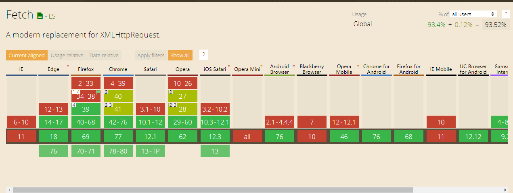
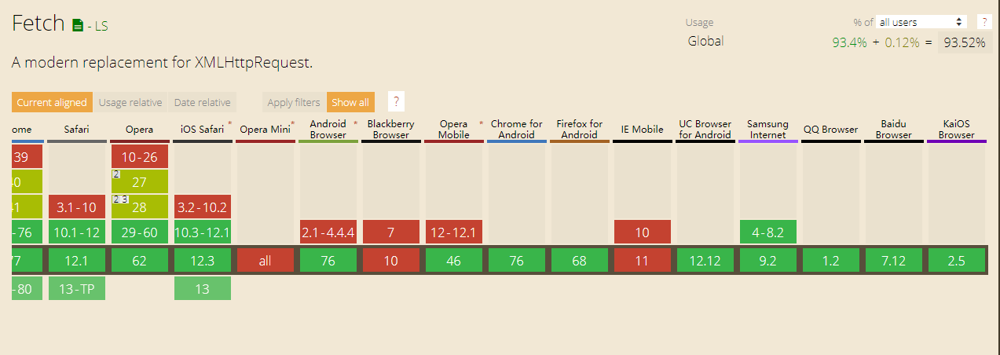

##### 1、fetch优点
    （1）接口更简单、简洁，更加语义化；
    （2）基于promise，更加好的流程化控制，可以不断then把参数传递，外加 async/await，异步变同步的代码书写风格；
    （3）利于同构，isomorphic-fetch 是对 whatwg-fetch和node-fetch的一种封装，你一份代码就可以在两种环境下跑起来了；
    （4）新的web api很多内置支持fetch，比如 service worker；
##### 2、fetch缺点
    （1）兼容性；
    （2）不支持progress事件（可以借助 response.body.getRender方法来实现）；
    （3）默认不带cookie；
    （4）某些错误的http状态下如400、500等不会reject，相反它会被resolve；
    （5）不支持timeout处理；
    （6）不支持jsonp，当然可以引入 fetch-jsonp 来支持；
    （7）没有拦截器得自己写；


````js
(function (self) {
  'use strict';

  //如果自身支持fetch，直接返回原生的fetch
  if (self.fetch) {
    // return
  }

  // 一些功能检测
  var support = {
    searchParams: 'URLSearchParams' in self, // queryString 处理函数，https://developer.mozilla.org/en-US/docs/Web/API/URLSearchParams，http://caniuse.com/#search=URLSearchParams
    iterable: 'Symbol' in self && 'iterator' in Symbol,  // Symbol(http://es6.ruanyifeng.com/#docs/symbol)E6新数据类型，表示独一无二的值 和 iterator枚举
    blob: 'FileReader' in self && 'Blob' in self && (function () {
      try {
        new Blob()
        return true
      } catch (e) {
        return false
      }
    })(),  // Blob 和 FileReader
    formData: 'FormData' in self, // FormData
    arrayBuffer: 'ArrayBuffer' in self // ArrayBuffer 二进制数据存储
  }

  // 支持的 ArrayBuffer类型
  if (support.arrayBuffer) {
    var viewClasses = [
      '[object Int8Array]',
      '[object Uint8Array]',
      '[object Uint8ClampedArray]',
      '[object Int16Array]',
      '[object Uint16Array]',
      '[object Int32Array]',
      '[object Uint32Array]',
      '[object Float32Array]',
      '[object Float64Array]'
    ]

    // 检查是不是DataView,DataView是来读写ArrayBuffer的 https://developer.mozilla.org/en-US/docs/Web/JavaScript/Reference/Global_Objects/DataView
    var isDataView = function (obj) {
      return obj && DataView.prototype.isPrototypeOf(obj)
    }

    // 检查是不是有效的ArrayBuffer view，TypedArray均返回true ArrayBuffer.isView(new ArrayBuffer(10)) 为false, https://developer.mozilla.org/en-US/docs/Web/JavaScript/Reference/Global_Objects/ArrayBuffer/isView
    var isArrayBufferView = ArrayBuffer.isView || function (obj) {
      return obj && viewClasses.indexOf(Object.prototype.toString.call(obj)) > -1
    }
  }

  // 检查header name，并转为小写
  function normalizeName(name) {
    // 不是字符串，转为字符串
    if (typeof name !== 'string') {
      name = String(name)
    }
    // 不以 a-z 0-9 -#$%*+.^_`|~ 开头，抛出错误
    if (/[^a-z0-9\-#$%&'*+.\^_`|~]/i.test(name)) {
      throw new TypeError('Invalid character in header field name')
    }
    //转为小写
    return name.toLowerCase()
  }

  // 转换header的值
  function normalizeValue(value) {
    if (typeof value !== 'string') {
      value = String(value)
    }
    return value
  }

  // 枚举器, http://es6.ruanyifeng.com/#docs/iterator
  // 觉得可以如下 ,同样支持 next() 和 for ...of 等形式访问 ,之后才是不支持iterable的情况，添加next方法来访问
  //  if ((support.iterable && items[Symbol.iterator]) {
  //   return items[Symbol.iterator]()
  // }
  function iteratorFor(items) {
    // 这里你就可以 res.headers.keys().next().value这样调用
    var iterator = {
      next: function () {
        var value = items.shift()
        return { done: value === undefined, value: value }
      }
    }

    if (support.iterable) {
      // 添加默认Iterator
      // for...of,解构赋值,扩展运算符,yield*,Map(), Set(), WeakMap(), WeakSet(),Promise.all(),Promise.race()都会调用默认Iterator     
      iterator[Symbol.iterator] = function () {
        return iterator
      }
    }

    // 到这里就支持了两种访问形式了
    // res.headers.keys().next().value
    // for(let key in headers.keys())
    return iterator
  }

  // 封装的 Headers，支持的方法参考https://developer.mozilla.org/en-US/docs/Web/API/Headers
  function Headers(headers) {
    this.map = {} // headers 最终存储的地方

    if (headers instanceof Headers) { // 如果已经是 Headers的实例，复制键值
      headers.forEach(function (value, name) {
        this.append(name, value)
      }, this) // this修改forEach执行函数上下文为当前上下文，就可以直接调用append方法了
    } else if (Array.isArray(headers)) { // 如果是数组，[['Content-Type':''],['Referer','']]
      headers.forEach(function (header) {
        this.append(header[0], header[1])
      }, this)
    } else if (headers) {
      // 对象  {'Content-Type':'',Referer:''}
      Object.getOwnPropertyNames(headers).forEach(function (name) {
        this.append(name, headers[name])
      }, this)
    }
  }

  // 添加或者追加Header
  Headers.prototype.append = function (name, value) {
    name = normalizeName(name)
    value = normalizeValue(value)
    var oldValue = this.map[name]
    // 支持 append, 比如 Accept:text/html ，后来 append('Accept','application/xhtml+xml') 那么最终  Accept:'text/html,application/xhtml+xml'
    this.map[name] = oldValue ? oldValue + ',' + value : value
  }

  //删除名为name的Header
  Headers.prototype['delete'] = function (name) {
    delete this.map[normalizeName(name)]
  }

  //获得名为Name的Header
  Headers.prototype.get = function (name) {
    name = normalizeName(name)
    return this.has(name) ? this.map[name] : null
  }

  //查询时候有名为name的Header
  Headers.prototype.has = function (name) {
    return this.map.hasOwnProperty(normalizeName(name))
  }
  //设置或者覆盖名为name，值为vaue的Header
  Headers.prototype.set = function (name, value) {
    this.map[normalizeName(name)] = normalizeValue(value)
  }
  //遍历Headers
  Headers.prototype.forEach = function (callback, thisArg) {
    //遍历属性   
    //我觉得也挺不错 Object.getOwnPropertyNames(this.map).forEach(function(name){ callback.call(thisArg, this.map[name], name, this) },this)
    for (var name in this.map) {
      //检查是不是自己的属性
      if (this.map.hasOwnProperty(name)) {
        //调用
        callback.call(thisArg, this.map[name], name, this)
      }
    }
  }

  // 所有的键，keys, values, entries, res.headers返回的均是 iterator 
  Headers.prototype.keys = function () {
    var items = []
    this.forEach(function (value, name) { items.push(name) })
    return iteratorFor(items)
  }
  // 所有的值，keys, values, entries, res.headers返回的均是 iterator 
  Headers.prototype.values = function () {
    var items = []
    this.forEach(function (value) { items.push(value) })
    return iteratorFor(items)
  }
  // 所有的entries,格式是这样 [[name1,value1],[name2,value2]]，keys, values, entries, res.headers返回的均是 iterator 
  Headers.prototype.entries = function () {
    var items = []
    this.forEach(function (value, name) { items.push([name, value]) })
    return iteratorFor(items)
  }

  //设置Headers原型默认的Iterator,keys, values, entries, res.headers返回的均是 iterator 
  if (support.iterable) {
    Headers.prototype[Symbol.iterator] = Headers.prototype.entries
  }

  //是否已经消费/读取过，如果读取过，会直接到catch或者error处理函数
  function consumed(body) {
    if (body.bodyUsed) {
      return Promise.reject(new TypeError('Already read'))
    }
    body.bodyUsed = true
  }

  // FileReader读取完毕
  function fileReaderReady(reader) {
    return new Promise(function (resolve, reject) {
      reader.onload = function () {
        resolve(reader.result)
      }
      reader.onerror = function () {
        reject(reader.error)
      }
    })
  }

  // 读取blob为ArrayBuffer对象，https://www.w3.org/TR/FileAPI/#dfn-filereader
  function readBlobAsArrayBuffer(blob) {
    var reader = new FileReader()
    var promise = fileReaderReady(reader)
    reader.readAsArrayBuffer(blob)
    return promise
  }
  // 读取blob为文本，https://www.w3.org/TR/FileAPI/#dfn-filereader
  function readBlobAsText(blob) {
    var reader = new FileReader()
    var promise = fileReaderReady(reader)
    reader.readAsText(blob)
    return promise
  }

  // ArrayBuffer读为文本
  function readArrayBufferAsText(buf) {
    var view = new Uint8Array(buf)
    var chars = new Array(view.length)

    for (var i = 0; i < view.length; i++) {
      chars[i] = String.fromCharCode(view[i])
    }
    return chars.join('')
  }

  //克隆ArrayBuffer
  function bufferClone(buf) {
    if (buf.slice) {  //支持 slice，直接slice(0)复制，数据基本都是这样复制的
      return buf.slice(0)
    } else {
      //新建填充模式复制
      var view = new Uint8Array(buf.byteLength)
      view.set(new Uint8Array(buf))
      return view.buffer
    }
  }

  //方法参考：https://developer.mozilla.org/en-US/docs/Web/API/Body
  function Body() {
    this.bodyUsed = false

    this._initBody = function (body) {
      // 把最原始的数据存下来
      this._bodyInit = body
      // 判断body数据类型，然后存下来
      if (!body) {
        this._bodyText = ''
      } else if (typeof body === 'string') {
        this._bodyText = body
      } else if (support.blob && Blob.prototype.isPrototypeOf(body)) {
        this._bodyBlob = body
      } else if (support.formData && FormData.prototype.isPrototypeOf(body)) {
        this._bodyFormData = body
      } else if (support.searchParams && URLSearchParams.prototype.isPrototypeOf(body)) {
        this._bodyText = body.toString()   //数据格式是这样的 a=1&b=2&c=3
      } else if (support.arrayBuffer && support.blob && isDataView(body)) {
        // ArrayBuffer一般是通过DataView或者各种Float32Array,Uint8Array来操作的， https://hacks.mozilla.org/2017/01/typedarray-or-dataview-understanding-byte-order/
        // 如果是DataView， DataView的数据是存在 DataView.buffer上的
        this._bodyArrayBuffer = bufferClone(body.buffer)  // 复制ArrayBuffer
        // IE 10-11 can't handle a DataView body.
        this._bodyInit = new Blob([this._bodyArrayBuffer]) // 重新设置_bodyInt
      } else if (support.arrayBuffer && (ArrayBuffer.prototype.isPrototypeOf(body) || isArrayBufferView(body))) {
        // ArrayBuffer一般是通过DataView或者各种Float32Array,Uint8Array来操作的， 
        // https://hacks.mozilla.org/2017/01/typedarray-or-dataview-understanding-byte-order/
        this._bodyArrayBuffer = bufferClone(body)
      } else {
        throw new Error('unsupported BodyInit type')
      }

      // 设置content-type
      if (!this.headers.get('content-type')) {
        if (typeof body === 'string') {
          this.headers.set('content-type', 'text/plain;charset=UTF-8')
        } else if (this._bodyBlob && this._bodyBlob.type) {
          this.headers.set('content-type', this._bodyBlob.type)
        } else if (support.searchParams && URLSearchParams.prototype.isPrototypeOf(body)) {
          this.headers.set('content-type', 'application/x-www-form-urlencoded;charset=UTF-8')
        }
      }
    }

    if (support.blob) {
      // 使用 fetch(...).then(res=>res.blob())
      this.blob = function () {
        //标记为已经使用
        var rejected = consumed(this)
        if (rejected) {
          return rejected
        }

        // resolve，进入then
        if (this._bodyBlob) {
          return Promise.resolve(this._bodyBlob)
        } else if (this._bodyArrayBuffer) {
          return Promise.resolve(new Blob([this._bodyArrayBuffer]))
        } else if (this._bodyFormData) {
          throw new Error('could not read FormData body as blob')
        } else {
          return Promise.resolve(new Blob([this._bodyText]))
        }
      }
      // 使用 fetch(...).then(res=>res.arrayBuffer())
      this.arrayBuffer = function () {
        if (this._bodyArrayBuffer) {
          return consumed(this) || Promise.resolve(this._bodyArrayBuffer)
        } else {
          return this.blob().then(readBlobAsArrayBuffer) //如果有blob，读取成ArrayBuffer
        }
      }
    }

    // 使用 fetch(...).then(res=>res.text())
    this.text = function () {
      var rejected = consumed(this)
      if (rejected) {
        return rejected
      }

      if (this._bodyBlob) {
        return readBlobAsText(this._bodyBlob)
      } else if (this._bodyArrayBuffer) {
        return Promise.resolve(readArrayBufferAsText(this._bodyArrayBuffer))
      } else if (this._bodyFormData) {
        throw new Error('could not read FormData body as text')
      } else {
        return Promise.resolve(this._bodyText)
      }
    }

    // 使用 fetch(...).then(res=>res.formData())
    if (support.formData) {
      this.formData = function () {
        return this.text().then(decode)
      }
    }

    // 使用 fetch(...).then(res=>res.json())
    this.json = function () {
      return this.text().then(JSON.parse)
    }

    return this
  }

  // HTTP methods whose capitalization should be normalized
  var methods = ['DELETE', 'GET', 'HEAD', 'OPTIONS', 'POST', 'PUT']

  // 方法名大写
  function normalizeMethod(method) {
    var upcased = method.toUpperCase()
    return (methods.indexOf(upcased) > -1) ? upcased : method
  }

  // 请求的Request对象 ，https://developer.mozilla.org/en-US/docs/Web/API/Request
  // cache,context,integrity,redirect,referrerPolicy 在MDN定义中是存在的
  function Request(input, options) {
    options = options || {}
    var body = options.body

    //如果已经是Request的实例，解析赋值
    if (input instanceof Request) {    
      if (input.bodyUsed) {
        throw new TypeError('Already read')
      }
      this.url = input.url  //请求的地址
      this.credentials = input.credentials  //登陆凭证
      if (!options.headers) { //headers
        this.headers = new Headers(input.headers) 
      }
      this.method = input.method  //请求方法 GET,POST......
      this.mode = input.mode      // same-origin,cors,no-cors
      if (!body && input._bodyInit != null) { //标记Request已经使用
        body = input._bodyInit
        input.bodyUsed = true
      }
    } else {
      this.url = String(input)
    }

    this.credentials = options.credentials || this.credentials || 'omit'
    if (options.headers || !this.headers) {
      this.headers = new Headers(options.headers)
    }
    this.method = normalizeMethod(options.method || this.method || 'GET')
    this.mode = options.mode || this.mode || null //same-origin,cors,no-cors
    this.referrer = null

    if ((this.method === 'GET' || this.method === 'HEAD') && body) {
      throw new TypeError('Body not allowed for GET or HEAD requests')
    }
    this._initBody(body)  //解析值 和设置content-type
  }

  // 克隆
  Request.prototype.clone = function () {
    return new Request(this, { body: this._bodyInit })
  }

  // body存为 FormData
  function decode(body) {
    var form = new FormData()
    body.trim().split('&').forEach(function (bytes) {
      if (bytes) {
        var split = bytes.split('=')
        var name = split.shift().replace(/\+/g, ' ')
        var value = split.join('=').replace(/\+/g, ' ')
        form.append(decodeURIComponent(name), decodeURIComponent(value))
      }
    })
    return form
  }

  // 用于接续 xhr.getAllResponseHeaders, 数据格式
  //Cache-control: private
  //Content-length:554
  function parseHeaders(rawHeaders) {
    var headers = new Headers()
    // Replace instances of \r\n and \n followed by at least one space or horizontal tab with a space
    // https://tools.ietf.org/html/rfc7230#section-3.2
    var preProcessedHeaders = rawHeaders.replace(/\r?\n[\t ]+/g, ' ')
    preProcessedHeaders.split(/\r?\n/).forEach(function (line) {
      var parts = line.split(':')
      var key = parts.shift().trim()
      if (key) {
        var value = parts.join(':').trim()
        headers.append(key, value)
      }
    })
    return headers
  }

  Body.call(Request.prototype)  //把Body方法属性绑到 Reques.prototype

  // Reponse对象，https://developer.mozilla.org/en-US/docs/Web/API/Response
  function Response(bodyInit, options) {
    if (!options) {
      options = {}
    }

    this.type = 'default'
    this.status = options.status === undefined ? 200 : options.status
    this.ok = this.status >= 200 && this.status < 300  // 200 - 300 ,https://developer.mozilla.org/en-US/docs/Web/API/Response/ok
    this.statusText = 'statusText' in options ? options.statusText : 'OK'
    this.headers = new Headers(options.headers)
    this.url = options.url || ''
    this._initBody(bodyInit) // 解析值和设置content-type
  }

  Body.call(Response.prototype) //把Body方法属性绑到 Reques.prototype

  // 克隆Response
  Response.prototype.clone = function () {
    return new Response(this._bodyInit, {
      status: this.status,
      statusText: this.statusText,
      headers: new Headers(this.headers),
      url: this.url
    })
  }

  //返回一个 error性质的Response，静态方法
  Response.error = function () {
    var response = new Response(null, { status: 0, statusText: '' })
    response.type = 'error'
    return response
  }

  var redirectStatuses = [301, 302, 303, 307, 308]

  // 重定向，本身并不产生实际的效果，静态方法，https://developer.mozilla.org/en-US/docs/Web/API/Response/redirect
  Response.redirect = function (url, status) {
    if (redirectStatuses.indexOf(status) === -1) {
      throw new RangeError('Invalid status code')
    }

    return new Response(null, { status: status, headers: { location: url } })
  }

  self.Headers = Headers  //暴露Headers
  self.Request = Request //暴露Request
  self.Response = Response //暴露Response

  self.fetch = function (input, init) {
    return new Promise(function (resolve, reject) {
      var request = new Request(input, init)  //初始化request对象
      var xhr = new XMLHttpRequest()  // 初始化 xhr

      xhr.onload = function () { //请求成功，构建Response，并resolve进入下一阶段
        var options = {
          status: xhr.status,
          statusText: xhr.statusText,
          headers: parseHeaders(xhr.getAllResponseHeaders() || '')
        }
        options.url = 'responseURL' in xhr ? xhr.responseURL : options.headers.get('X-Request-URL')
        var body = 'response' in xhr ? xhr.response : xhr.responseText
        resolve(new Response(body, options))
      }

      //请求失败，构建Error，并reject进入下一阶段
      xhr.onerror = function () {
        reject(new TypeError('Network request failed'))
      }

      //请求超时，构建Error，并reject进入下一阶段
      xhr.ontimeout = function () {
        reject(new TypeError('Network request failed'))
      }

      // 设置xhr参数
      xhr.open(request.method, request.url, true)

      // 设置 credentials 
      if (request.credentials === 'include') {
        xhr.withCredentials = true
      } else if (request.credentials === 'omit') {
        xhr.withCredentials = false
      }

      // 设置 responseType
      if ('responseType' in xhr && support.blob) {
        xhr.responseType = 'blob'
      }

      // 设置Header
      request.headers.forEach(function (value, name) {
        xhr.setRequestHeader(name, value)
      })
      // 发送请求
      xhr.send(typeof request._bodyInit === 'undefined' ? null : request._bodyInit)
    })
  }
  //标记是fetch是polyfill的，而不是原生的
  self.fetch.polyfill = true
})(typeof self !== 'undefined' ? self : this); // IIFE函数的参数，不用window，web worker, service worker里面也可以使用
````