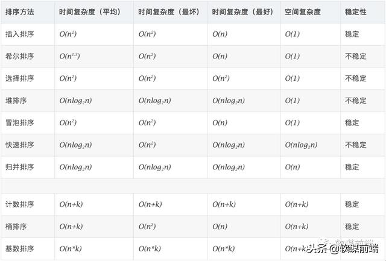

#### 1、冒泡排序
````js
export function BubbleSort(array) {
  const { length } = array;
  let didSwap;
  for (let i=0; i<length; i++) {
    //是有序的
    didSwap=false;
    for (let j=0; j<length-1-i; j++) {
      if (array[j]>array[j+1]) {
        [array[j],array[j+1]] = [array[j+1],array[j]];
        //不是有序的
        didSwap=true;
      }
    }
    if (!didSwap) {
      return
    }
  }
  return array;
}
````
#### 2、选择排序
````js
export const selectionSort = (array) => {
  const {length} = array;
  let indexMin;
  for (let i=0; i<length-1; i++) {
    indexMin = i;
    for (let j=i; j<length; i++) {
      if (array[indexMin]>array[j]) {
        indexMin = j;
      }
    }
    if (i !== indexMin) {
      [array[i],array[indexMin]] = [array[indexMin],array[i]]
    }
  }
  return array;
};
````
#### 3、插入排序
````js
export const insertionSort = (array) => {
  const { length } = array;
  let temp;
  for (let i=1; i<length; i++) {
    let j=i;
    temp = array[i];
    while (j>0 && array[j-1]>temp) {
      array[j] = array[j-1];
      j--;
    }
    array[j] = temp;
  }
  return array;
};
````
#### 4、希尔排序
````js
export function shellSort(array) {
  let increment = array.length/2;
  while (increment > 0) {
    for (let i = increment; i<array.length; i++) {
      let j = i;
      const temp = array[i];
      while (j >= increment && (array[j-increment]>temp)) {
        array[j] = array[j-increment];
        j -= increment;
      }
      array[j] = temp;
    }
    if (increment === 2) {
      increment = 1;
    } else {
      increment = Math.floor((increment * 5)/11);
    }
  }
  return array;
}
````
#### 5、归并排序
````js
function merge(left,right) {
  let i = 0;
  let j = 0;
  const result = [];
  while (i < left.length && j < right.length) {
    result.push(left[i]<right[j]?left[i++]:right[j++]);
  }
  return result.concat(i<left.length?left.slice(i):right.slice(j));
}
export function mergeSort(array) {
  if (array.length>1) {
    const { length } = array;
    const middle = Math.floor(length/2);
    const left = mergeSort(array.slice(0, middle));
    const right = mergeSort(array.slice(middle, length));
    array = merge(left, right)
  }
  return array;
}

````
#### 6、快速排序
````js
function partition(array,left,right) {
  const pivot = array[Math.floor((right+left)/2)];
  let i = left;
  let j = right;
  while (i<=j) {
    while (array[i]<pivot) {
      i++;
    }
    while (array[j]>pivot) {
      j--;
    }
    if (i<=j) {
      [array[i],array[j]] = [array[j],array[i]];
      i++;
      j--;
    }
  }
  return i;
}
function quick(array,left,right) {
  let index;
  if (array.length > 1) {
    index = partition(array,left,right);
    if (left < index -1) {
      quick(array,left,index-1);
    }
    if (index < right) {
      quick(array,index,right);
    }
  }
}

export function quickSort(array) {
  return quick(array, 0, array.length -1)
}
````
#### 7、堆排序
````js
//最关键的就是第二个参数，除了刚开始构建大顶堆，其他变动都是换了哪里（index），从哪里开始比较左右重新构建大顶堆
function heapify(array,index,heapSize) {
  let largest = index;
  let left = (index*2)+1;
  let right = (index*2)+2;
  if (left<heapSize && (array[largest]<array[left])) {
    largest = left;
  }
  if (right<heapSize && (array[largest]<array[right])) {
    largest = right;
  }
  if (largest !==index) {
    [array[index],array[largest]] = [array[largest],array[index]];
    heapify(array,largest,heapSize);
  }
}
function buildMaxHeap(array) {
  for(let i=Math.floor(array.length/2); i>=0; i--){
    heapify(array,i,array.length);
  }
}
export function heapSort(array) {
  const { length } = array;
  let heapSize = length;
  //把数组建立成大顶堆
  buildMaxHeap(array);
  while (heapSize>1) {
    //把大顶堆最大的值array[0]和array[--heapSize]交换，放到数组后面
    [array[0],array[--heapSize]] = [array[--heapSize],array[0]];
    //已经交换过的最大值不进入新的大顶堆构建，继续构建新的大顶堆，把下一个最大值选出来交换到数组后面，直到heapSize小于2
    heapify(array,0,heapSize)
  }
}
````
#### 8、计数排序
````js
function findMaxValue(array) {
  if(array && array.length>0) {
    let max = array[0];
    //循环遍历数组，有比max大的值就替换max。
    for (let i=1; i<array.length; i++) {
      if (max<array[i]) {
        max = array;
      }
    }
    return max;
  }
  return undefined;
}

export function countingSort(array) {
  //判断数组小于2就可以直接返回了
  if(array.length<2) {
    return array;
  }
  //找到数组里的最大值
  const maxValue = findMaxValue(array);
  let sortedIndex = 0;
  //设置最大值加一，固定长度的数组，作为计数数组
  const counts = new Array(maxValue + 1);
  //用数组值做为计数数组下标，第一次遍历到是初始化为0，后续再遍历到就在基础上加一。
  array.forEach(element => {
    if (!counts[element]) {
      counts[element] = 0;
    }
    counts[element]++;
  });
  //第一层遍历是循环给出当前值是什么（i），一共多少个（element）。第二层遍历就是根据一共多少个，循环重复element次修改i进数组
  counts.forEach((element,i) => {
    while(element > 0) {
      array[sortedIndex++] = i;
      element--;
    }
  });
}
````
#### 9、桶数排序
````js
function insertionSort(array) {
  const { length } = array;
  let temp;
  //第一层循环控制循环比较的终点位置
  for (let i=1; i<length; i++) {
    let j=i;
    //把终点位置的值取出暂时存放，为往后循环挪动留出空间
    temp=array[i];
    //循环往后挪动的条件是比暂时存放的值要大
    while (j>0 && (array[j-1]>temp)) {
      array[j] = array[j-1];
      j--;
    }
    //前面没有比暂时存放的只要大了，就可以插入当前位置了
    array[j] = temp;
  }
  return array;
}
function sortBuckets(buckets) {
  const sortedArray = [];
  //遍历每个桶并用插入排序算法来给每个桶排序，再按桶顺序把排序好的子数组分别push进新数组。
  for (let i=0;i<buckets.length;i++){
    if (buckets[i] != null) {
      insertionSort(buckets[i]);
      sortedArray.push(...buckets[i]);
    }
  }
  return sortedArray;
}

function createBuckets(array,bucketSize) {
  //找出最大最小值
  let minValue = array[0];
  let maxValue = array[0];
  for (let i=1;i<array.length;i++){
    if (array[i] < minValue) {
      minValue = array[i];
    } else if (array[i] > maxValue) {
      maxValue = array[i];
    }
  }
  //计算桶的个数
  const bucketCount = Math.floor((maxValue-minValue)/bucketSize) + 1;
  //初始化桶
  const buckets = [];
  //给每个桶初始化为空数组
  for (let i=0; i<bucketCount; i++) {
    buckets[i] = [];
  }
  //当前值和最小值的差值除以桶的个数所得的结果来确定push进哪个桶。
  for (let i=0; i<array.length; i++) {
    buckets[Math.floor((array[i]-minValue)/bucketSize)].push(array[i]);
  }
  return buckets;
}
export function bucketSort(array, bucketSize = 5) {
  //数组小于2就可以直接返回数组
  if(array.length < 2) {
    return array;
  }
  //创建桶
  const buckets = createBuckets(bucketSize);
  //用创建好的桶就可以开始排序了
  return sortBuckets(buckets);
}
````
#### 10、基数排序
````js
//通过当前值和最小值的差值和代表位数的值相除在和10取余，算出该放哪个桶
const getBucketIndex = (value,minValue,significantDigit,radixBase) => Math.floor(((value-minValue)/significantDigit)%radixBase);
const countingSortForRadix = (array,radixBase,significantDigit,minValue) => {
  //初始化桶
  let bucketsIndex;
  const buckets = [];
  const aux = [];
  //设置radixBase个桶给每个桶设置初值为0
  for(let i=0; i<radixBase; i++){
    buckets[i] = 0;
  }
  //根据计算公式得出该放哪个桶，这个桶就加一
  for(let i=0; i<array.length; i++){
    bucketsIndex = getBucketIndex(array[i],minValue,significantDigit,radixBase);
    buckets[bucketsIndex]++;
  }
  //遍历桶，桶的计数结果按顺序累加
  for(let i=1; i<radixBase; i++) {
    buckets[i] +=buckets[i-1];
  }
  //根据计算公式得出是哪个桶，把这个桶的计数减一，再用这个计数作为该数的排序。
  for(let i=array.length-1;i>=0;i--){
    bucketsIndex = getBucketIndex(array[i],minValue,significantDigit,radixBase);
    aux[--buckets[bucketsIndex]] = array[i];
  }
  //把排好序的数组复制回去
  for(let i=0;i<array.length;i++){
    array[i] = aux[i];
  }
  return array
};

//rasixBase十进制
export function radixSort(array,radixBase=10) {
  //找出数组里的最大值和最小值
  let minValue = array[0];
  let maxValue = array[0];
  for (let i=0; i<array.length; i++){
    if(array[i]<minValue) {
      minValue = array[i];
    }else if(array[i]>maxValue){
      maxValue = array[i];
    }
  }
  //循环两次，个位排序一次，十位排序一次
  let significantDigit = 1;
  //循环条件最大值和最小值的差值除位数要大于或等于1，就是说差值要大于两位数，也就是数组里要排序的值肯定有两位数的
  while ((maxValue-minValue)/significantDigit >=1){
    array = countingSortForRadix(array, radixBase, significantDigit, minValue);
    significantDigit *=radixBase;
  }
}
````