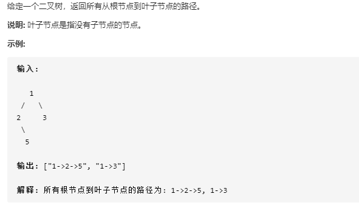
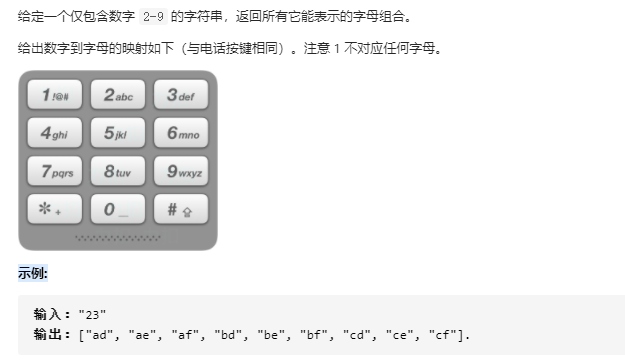
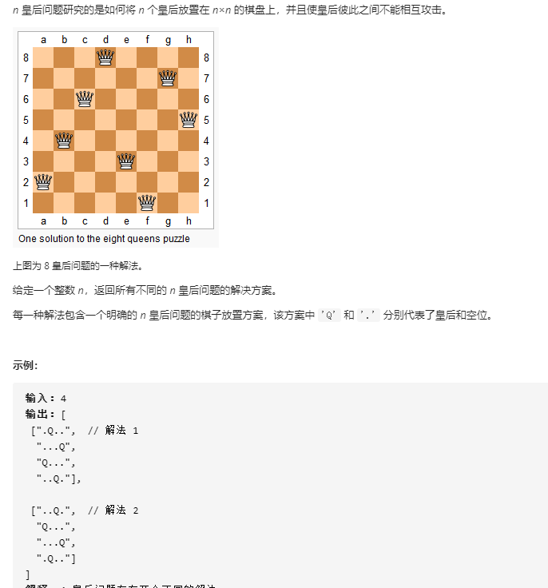
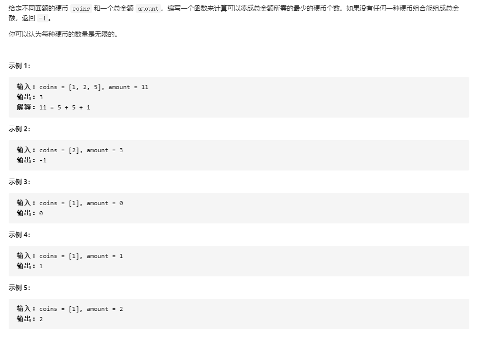

#### 1、算法分类
    从一个前端的角度算法分为四类，其中前三种是基础，后一种在其基础上衍生多变，但是万变不离其宗
    1、基础数据结构，例如： 数组、链表、树、图、字典、哈希表、集合等
    2、前端常用算法， 例如： 深克隆、浅克隆、一些源码及其衍生
    3、十大排序，例如： 冒泡排序、选择排序、插入排序、希尔排序、归并排序、快速排序、堆排序、计数排序、桶排序、基数排序
    4、leecode上的灵活多变的例子
#### 2、回溯算法
    解决一个回溯问题，实际上就是一个决策树的遍历过程。只需要思考三个问题：
    1、路径：也就是已经做出的选择。
    2、选择列表： 也就是你当前可以做出的选择。
    3、结束条件： 也就是到达决策树底层，无法再做选择的条件。
   ```js
   result = []
   backtrack(路径,选择列表){
      if(满足结束条件){
        result.add(路径)
        return
      }；
      for(选择 in 选择列表){
        做选择
        backtrack(路径,选择列表)
        撤销选择
      }
   }
   ````
   
   ````js
   // 二叉树的所有路径
   const binaryTreePaths = (root) => {
     // 1. 设置 result 获取结果
     const result = [];
     
     // 2. 递归树
     const recursion = (root, path = []) => {
       // 2.1 设置终止条件，当前节点为空就不再往下走
       if (!root) {
         return;
       }
   
       // 2.2 重点 1：将对应的值塞进 path 中
       path.push(root.val);
   
       // 2.3 遍历左右子树
       recursion(root.left, path);
       recursion(root.right, path);
   
       // 2.4 重点 2：如果当前节点的左右子树已经为空，那么就到底了
       if (!root.left && !root.right) {
         result.push(path.join('->'));
       }
   
       // 2.5 重点 3：回退这一步的操作，我们已经走完这条路了
       path.pop();
     };
     recursion(root, []);
   
     // 3. 返回结果
     return result;
   };
   
   const root = {
     val: 1,
     left: {
       val: 2,
       left: null,
       right: { val: 5, left: null, right: null },
     },
     right: { val: 3, left: null, right: null },
   };
   
   console.log(binaryTreePaths(root));
   ````
    
   ````js
   // 电话号码的字母组合
   const letterCombinations = (digits) => {
     if (digits.length == 0) return [];
     const res = [];
     const map = { '2': 'abc', '3': 'def', '4': 'ghi', '5': 'jkl', '6': 'mno', '7': 'pqrs', '8': 'tuv', '9': 'wxyz' };
   
     const dfs = (curStr, i) => {      // curStr是当前字符串，i是扫描的指针
       if (i > digits.length - 1) {    // 指针越界，递归的出口
         res.push(curStr);             // 将解推入res
         return;                       // 结束当前递归分支，进入另一个递归分支
       }
       const letters = map[digits[i]]; // 当前数字对应有哪些字母
       for (const l of letters) {      // 不同的字母选择代表不同的递归分支
         dfs(curStr + l, i + 1);       // 生成新字符串，i指针右移，递归
       }
     };
     dfs('', 0); // 递归的入口，初始字符串为''，指针为0
     return res;
   };
  ```` 
     
  ````js
   // N皇后
   const solveNQueens = (n) => {
     const board = new Array(n);
     for (let i = 0; i < n; i++) {
       board[i] = new Array(n).fill('.');
     }
   
     const cols = new Set();  // 列集，记录出现过皇后的列
     const diag1 = new Set(); // 正对角线集
     const diag2 = new Set(); // 反对角线集
     const res = [];
   
     const helper = (row) => {
       if (row == n) {
         const stringsBoard = board.slice();
         for (let i = 0; i < n; i++) {
           stringsBoard[i] = stringsBoard[i].join('');
         }
         res.push(stringsBoard);
         return;
       }
       for (let col = 0; col < n; col++) {
         // 如果当前点的行列对角线都没有皇后，即可选择，否则，跳过
         if (!cols.has(col) && !diag1.has(row + col) && !diag2.has(row - col)) { 
           board[row][col] = 'Q';  // 放置皇后
           cols.add(col);          // 记录放了皇后的列
           diag1.add(row + col);   // 记录放了皇后的正对角线
           diag2.add(row - col);
           helper(row + 1);
           board[row][col] = '.';  // 撤销该点的皇后
           cols.delete(col);       // 对应的记录也删一下
           diag1.delete(row + col);
           diag2.delete(row - col);
         }
       }
     };
     helper(0);
     return res;
   };
   ````
#### 3、动态规划
##### 3.1 动态规划解释
动态规划实质上是分步规划，分步存储法， 递推存储法，数列递推法，状态转移法.....等一系列方法的集合。
##### 3.2 能用动态规划解决的问题
###### 1、问题的答案依赖于问题的规模，也就是问题的所有答案构成了一个数列。举一个简单的例子，1个人有2条腿，2个人有4条腿，...，n个人有多少条腿？答案是2n条腿。这里的2n是问题的答案，n则是问题的规模，
###### 显然问题的答案是依赖于问题的规模的。答案是因变量，问题的规模是自变量，因此问题在所有规模下的答案可以构成一个数列（f（1），f（2），...，f（n）），比如刚刚“数腿”的例子就构成了间隔为2的等差数列（0,2,4，...，2n）。
###### 2、大规模问题的答案可以由小规模问题的答案递推得到，也就是f（n）的值可以由{f（i）|i<n}中的个别求得，还是刚刚“数腿”的例子，显然f（n）可以基于f（n-1）求得：f（n）=f（n-1）+2.
###### 3、合适用动态规划解决的问题，能用动态规划解决，不代表合适用。比如刚刚的“数腿”例子，你可以写成f（n）=2n的显示表达式形式，那么杀鸡就不必用牛刀了。但是，在许多场景，f（n）的显式式子是不易得到的，大多数情况下甚至无法得到。这个时候就可以用动态规划。
###### 4、应用动态规划---将动态规划拆分三个子目标
       1、建立状态转移方程
       2、缓存并复用以往结果
       3、按顺序从小往大算
````js
// 斐波那契数列
function fib(n) {
    if (n === 0) {
        return 0;
    }
    const dp = new Array(n);
    dp[1] = 1;
    dp[2] = 1;
    for (let i = 3; i <= n; i++) {
       dp[i] = dp[i -1] + dp[i-2];
    }
    return dp[n];
}
````
 
````js
var coinChange = function(coins, amount) {
  let dp = new Array(amount+1).fill(Infinity)
  dp[0] = 0
  for (let coin of coins ) {
    for (let i = 1; i <= amount; i++) {
      if (i - coin >= 0) {
        dp[i] = Math.min(dp[i], dp[i - coin] + 1)
      }
    }
  }
  return dp[amount] === Infinity ? -1 : dp[amount]
}
````