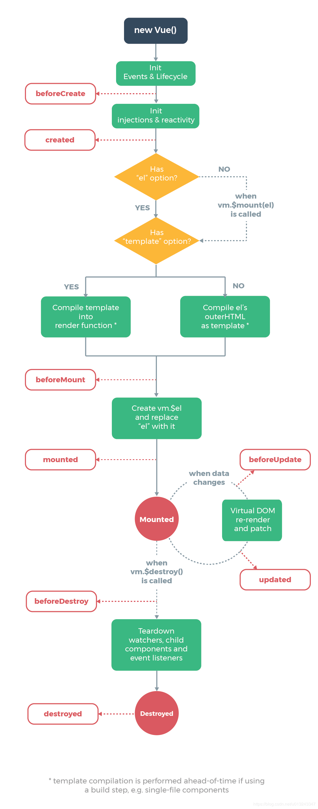

#### 1、vue.use()源码解析：
##### 相关概念：
    a、vue.use是vue中用于插件注册的方法，调用use方法是可以传其他参数的。
    b、apply方法能劫持另外一个对象的方法，继承另外一个对象的属性，Function.apply(obj,args)能接受两个参数，obj对象将代替
       Function类里的this对象，args是个数组，作为参数传给Function，Function.apply(null,args)指向window。
##### 流程描述：
    （1）vue.use接收一个参数plugin，用一个数组installedPlugin来判断是否已经注册，只能注册一次。
    （2）调用toArray截取除第一个参数外的其他参数作为数组。
    （3）把当前vue的对象this插入参数数组第一个。
    （4）判断如果plugin.install是一个方法，则传入以上参数数组。
    （5）判断plugin是否本身就是一个方法，就plugin.apply(null,args)指向window直接执行这个方法。
    （6）将注册后的插件插入installedPlugin。
#### 2、Vue.mixin()源码解析：
##### 相关概念：
    a、Vue.mixin()混合以一种灵活的方式为组件提供分布复用功能。混合对象可以包含任意的组件选项。当组件使用了混合对象时，混合对象的所有选项将被
      “混入”组件自己的选项中。
    b、Vue.extend只是创建一个构造器,他是为了创建可复用的组件。
    c、Vue.component 是用来注册或获取全局组件的方法，其作用是将通过 Vue.extend 生成的扩展实例构造器注册（命名）为一个组件。
      全局注册的组件可以在所有晚于该组件注册语句构造的Vue实例中使用。
        Vue.component('global-component', Vue.extend(baseOptions));
        //传入一个选项对象（自动调用 Vue.extend）,等价于上行代码.
        Vue.component('global-component', baseOptions);
        // 获取注册的组件（始终返回构造器）
        var MyComponent = Vue.component('my-component')
    d、Vue.extends 这和 mixins 类似，区别在于，组件自身的选项会比要扩展的源组件具有更高的优先级,接受参数的类型不同extends是对象,
      mixins接受的是数组。
##### 流程描述：
    1、如果是非生产环境下，首先调用 checkComponents 检查传入参数的合法性，后面再讲具体实现。
    2、调用 normalizeProps 方法和 normalizeDirectives 方法对这两个属性进行规范化。
    3、检查传入参数是否具有 extends 属性，在合并之前，需要先把 extends 进行合并，如果 extends 是一个 Vue 构造函数
    （也可能是扩展后的 Vue 构造函数），那么合并参数变为其 options 选项了；否则直接合并 extends。（有点像把多层递归遍历合并成一层）
    4、检查其 mixins 属性。传入的 Vue 配置对象有 mixins 的话，我们需要递归的进行 merge。
    5、开始合并单纯的 mixin 参数了。调用 mergeField 函数进行了合并。
    6、该函数通过 key 值在 strats 中选取合并的具体函数，分为三类，替换式、合并式、队列式。（策略模式）
        a、替换式el、props、methods、computed，这一类的行为是新的参数替代旧的参数。
        b、合并式data，这一类的行为是新传入的参数会被合并到旧的参数中。
        c、队列式watch、生命周期钩子（hooks），这一类的行为是所有的参数会被合并到一个数组中，必要时再依次取出。
#### 3、vue生命周期源码解析：

##### 相关概念：
##### 流程描述：
（1）new vue()构造函数
```js
    function Vue (options) {
      if (process.env.NODE_ENV !== 'production' &&
        !(this instanceof Vue)
      ) {
        warn('Vue is a constructor and should be called with the `new` keyword')
      }
      this._init(options)
    }
    
    initMixin(Vue)
    stateMixin(Vue)
    eventsMixin(Vue)
    lifecycleMixin(Vue)
    renderMixin(Vue)
    
    export default Vue
```
(2) 调用initMixin方法:
###### 在beforeCreate钩子被执行之前，先执行initLifecycle、initEvents、initRender，
###### 在created钩子被执行之前，先执行initInjections、initState、initProvide

```js
export function initMixin (Vue) {
	// 注意此处的 _init 方法，与 Vue 构造函数中的 _init 是同一个方法
	Vue.prototype._init = function (options) {
		const vm = this
		// 合并options (已简化处理)
		vm.$options = mergeOptions(resolveConstructorOptions(vm.constructor),options,vm)
		vm._self = vm
	    initLifecycle(vm)
	    initEvents(vm)
	    initRender(vm)
	    // 注意此处!!! 
	    callHook(vm, 'beforeCreate') // beforeCreate 钩子被执行
	    initInjections(vm) // resolve injections before data/props
	    initState(vm)
	    initProvide(vm) // resolve provide after data/props
	    // 注意此处!!! 
	    callHook(vm, 'created')// created钩子被执行
	}
}
```
#### 4、vuex install方法：
##### 相关概念：
    b、beforeCreate
##### 流程描述：
    （1）确保Vuex只安装一次。
    （2）混入beforeCreate钩子函数，可以在组件中使用this.$store。