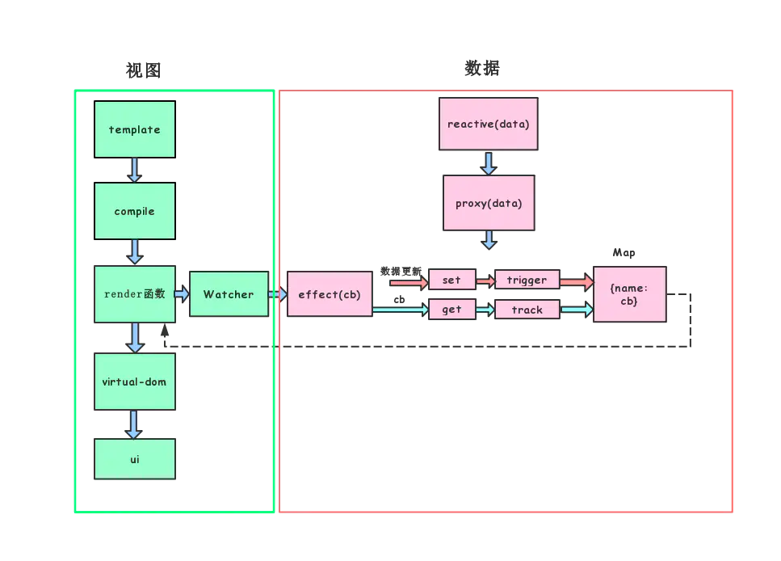

### 1.动态添加响应式属性必须用Vue.set

### 2.直接操作数组索引无法触发视图更新

### 3.数据的响应式处理和视图未完全解耦

#### 1、vue响应式原理
```js
export function reactive(target: object) {
  // if trying to observe a readonly proxy, return the readonly version.
  if (target && (target as Target)[ReactiveFlags.IS_READONLY]) {
    return target
  }
  return createReactiveObject(
    target,
    false,
    mutableHandlers,
    mutableCollectionHandlers,
    reactiveMap
  )
}


function createReactiveObject(
  target: Target,
  isReadonly: boolean,
  baseHandlers: ProxyHandler<any>,
  collectionHandlers: ProxyHandler<any>,
  proxyMap: WeakMap<Target, any>
) {
  if (!isObject(target)) {
    if (__DEV__) {
      console.warn(`value cannot be made reactive: ${String(target)}`)
    }
    return target
  }
  // target is already a Proxy, return it.
  // exception: calling readonly() on a reactive object
  if (
    target[ReactiveFlags.RAW] &&
    !(isReadonly && target[ReactiveFlags.IS_REACTIVE])
  ) {
    return target
  }
  // target already has corresponding Proxy
  const existingProxy = proxyMap.get(target)
  if (existingProxy) {
    return existingProxy
  }
  // only a whitelist of value types can be observed.
  const targetType = getTargetType(target)
  if (targetType === TargetType.INVALID) {
    return target
  }
  const proxy = new Proxy(
    target,
    targetType === TargetType.COLLECTION ? collectionHandlers : baseHandlers
  )
  proxyMap.set(target, proxy)
  return proxy
}
```
#### baseHandlers.ts

```js
const arrayInstrumentations: Record<string, Function> = {}
// instrument identity-sensitive Array methods to account for possible reactive
// values
;(['includes', 'indexOf', 'lastIndexOf'] as const).forEach(key => {
  const method = Array.prototype[key] as any
  arrayInstrumentations[key] = function(this: unknown[], ...args: unknown[]) {
    const arr = toRaw(this)
    for (let i = 0, l = this.length; i < l; i++) {
      track(arr, TrackOpTypes.GET, i + '')
    }
    // we run the method using the original args first (which may be reactive)
    const res = method.apply(arr, args)
    if (res === -1 || res === false) {
      // if that didn't work, run it again using raw values.
      return method.apply(arr, args.map(toRaw))
    } else {
      return res
    }
  }
})
// instrument length-altering mutation methods to avoid length being tracked
// which leads to infinite loops in some cases (#2137)
;(['push', 'pop', 'shift', 'unshift', 'splice'] as const).forEach(key => {
  const method = Array.prototype[key] as any
  arrayInstrumentations[key] = function(this: unknown[], ...args: unknown[]) {
    pauseTracking()
    const res = method.apply(this, args)
    resetTracking()
    return res
  }
})

function createGetter(isReadonly = false, shallow = false) {
  return function get(target: Target, key: string | symbol, receiver: object) {
    if (key === ReactiveFlags.IS_REACTIVE) {
      return !isReadonly
    } else if (key === ReactiveFlags.IS_READONLY) {
      return isReadonly
    } else if (
      key === ReactiveFlags.RAW &&
      receiver ===
        (isReadonly
          ? shallow
            ? shallowReadonlyMap
            : readonlyMap
          : shallow
            ? shallowReactiveMap
            : reactiveMap
        ).get(target)
    ) {
      return target
    }

    const targetIsArray = isArray(target)

    if (!isReadonly && targetIsArray && hasOwn(arrayInstrumentations, key)) {
      return Reflect.get(arrayInstrumentations, key, receiver)
    }

    const res = Reflect.get(target, key, receiver)

    if (
      isSymbol(key)
        ? builtInSymbols.has(key as symbol)
        : isNonTrackableKeys(key)
    ) {
      return res
    }

    if (!isReadonly) {
      track(target, TrackOpTypes.GET, key)
    }

    if (shallow) {
      return res
    }

    if (isRef(res)) {
      // ref unwrapping - does not apply for Array + integer key.
      const shouldUnwrap = !targetIsArray || !isIntegerKey(key)
      return shouldUnwrap ? res.value : res
    }

    if (isObject(res)) {
      // Convert returned value into a proxy as well. we do the isObject check
      // here to avoid invalid value warning. Also need to lazy access readonly
      // and reactive here to avoid circular dependency.
      return isReadonly ? readonly(res) : reactive(res)
    }

    return res
  }
}

const set = /*#__PURE__*/ createSetter()
const shallowSet = /*#__PURE__*/ createSetter(true)

function createSetter(shallow = false) {
  return function set(
    target: object,
    key: string | symbol,
    value: unknown,
    receiver: object
  ): boolean {
    let oldValue = (target as any)[key]
    if (!shallow) {
      value = toRaw(value)
      oldValue = toRaw(oldValue)
      if (!isArray(target) && isRef(oldValue) && !isRef(value)) {
        oldValue.value = value
        return true
      }
    } else {
      // in shallow mode, objects are set as-is regardless of reactive or not
    }

    const hadKey =
      isArray(target) && isIntegerKey(key)
        ? Number(key) < target.length
        : hasOwn(target, key)
    const result = Reflect.set(target, key, value, receiver)
    // don't trigger if target is something up in the prototype chain of original
    if (target === toRaw(receiver)) {
      if (!hadKey) {
        trigger(target, TriggerOpTypes.ADD, key, value)
      } else if (hasChanged(value, oldValue)) {
        trigger(target, TriggerOpTypes.SET, key, value, oldValue)
      }
    }
    return result
  }
}
```
#### effect.ts

```js
export function effect<T = any>(
  fn: () => T,
  options: ReactiveEffectOptions = EMPTY_OBJ
): ReactiveEffect<T> {
  if (isEffect(fn)) {
    fn = fn.raw
  }
  const effect = createReactiveEffect(fn, options)
  if (!options.lazy) {
    effect()
  }
  return effect
}

export function stop(effect: ReactiveEffect) {
  if (effect.active) {
    cleanup(effect)
    if (effect.options.onStop) {
      effect.options.onStop()
    }
    effect.active = false
  }
}

let uid = 0

function createReactiveEffect<T = any>(
  fn: () => T,
  options: ReactiveEffectOptions
): ReactiveEffect<T> {
  const effect = function reactiveEffect(): unknown {
    if (!effect.active) {
      return options.scheduler ? undefined : fn()
    }
    if (!effectStack.includes(effect)) {
      cleanup(effect)
      try {
        enableTracking()
        effectStack.push(effect)
        activeEffect = effect
        return fn()
      } finally {
        effectStack.pop()
        resetTracking()
        activeEffect = effectStack[effectStack.length - 1]
      }
    }
  } as ReactiveEffect
  effect.id = uid++
  effect.allowRecurse = !!options.allowRecurse
  effect._isEffect = true
  effect.active = true
  effect.raw = fn
  effect.deps = []
  effect.options = options
  return effect
}

function cleanup(effect: ReactiveEffect) {
  const { deps } = effect
  if (deps.length) {
    for (let i = 0; i < deps.length; i++) {
      deps[i].delete(effect)
    }
    deps.length = 0
  }
}

let shouldTrack = true
const trackStack: boolean[] = []

export function pauseTracking() {
  trackStack.push(shouldTrack)
  shouldTrack = false
}

export function enableTracking() {
  trackStack.push(shouldTrack)
  shouldTrack = true
}

export function resetTracking() {
  const last = trackStack.pop()
  shouldTrack = last === undefined ? true : last
}

export function track(target: object, type: TrackOpTypes, key: unknown) {
  if (!shouldTrack || activeEffect === undefined) {
    return
  }
  let depsMap = targetMap.get(target)
  if (!depsMap) {
    targetMap.set(target, (depsMap = new Map()))
  }
  let dep = depsMap.get(key)
  if (!dep) {
    depsMap.set(key, (dep = new Set()))
  }
  if (!dep.has(activeEffect)) {
    dep.add(activeEffect)
    activeEffect.deps.push(dep)
    if (__DEV__ && activeEffect.options.onTrack) {
      activeEffect.options.onTrack({
        effect: activeEffect,
        target,
        type,
        key
      })
    }
  }
}

export function trigger(
  target: object,
  type: TriggerOpTypes,
  key?: unknown,
  newValue?: unknown,
  oldValue?: unknown,
  oldTarget?: Map<unknown, unknown> | Set<unknown>
) {
  const depsMap = targetMap.get(target)
  if (!depsMap) {
    // never been tracked
    return
  }

  const effects = new Set<ReactiveEffect>()
  const add = (effectsToAdd: Set<ReactiveEffect> | undefined) => {
    if (effectsToAdd) {
      effectsToAdd.forEach(effect => {
        if (effect !== activeEffect || effect.allowRecurse) {
          effects.add(effect)
        }
      })
    }
  }

  if (type === TriggerOpTypes.CLEAR) {
    // collection being cleared
    // trigger all effects for target
    depsMap.forEach(add)
  } else if (key === 'length' && isArray(target)) {
    depsMap.forEach((dep, key) => {
      if (key === 'length' || key >= (newValue as number)) {
        add(dep)
      }
    })
  } else {
    // schedule runs for SET | ADD | DELETE
    if (key !== void 0) {
      add(depsMap.get(key))
    }

    // also run for iteration key on ADD | DELETE | Map.SET
    switch (type) {
      case TriggerOpTypes.ADD:
        if (!isArray(target)) {
          add(depsMap.get(ITERATE_KEY))
          if (isMap(target)) {
            add(depsMap.get(MAP_KEY_ITERATE_KEY))
          }
        } else if (isIntegerKey(key)) {
          // new index added to array -> length changes
          add(depsMap.get('length'))
        }
        break
      case TriggerOpTypes.DELETE:
        if (!isArray(target)) {
          add(depsMap.get(ITERATE_KEY))
          if (isMap(target)) {
            add(depsMap.get(MAP_KEY_ITERATE_KEY))
          }
        }
        break
      case TriggerOpTypes.SET:
        if (isMap(target)) {
          add(depsMap.get(ITERATE_KEY))
        }
        break
    }
  }

  const run = (effect: ReactiveEffect) => {
    if (__DEV__ && effect.options.onTrigger) {
      effect.options.onTrigger({
        effect,
        target,
        key,
        type,
        newValue,
        oldValue,
        oldTarget
      })
    }
    if (effect.options.scheduler) {
      effect.options.scheduler(effect)
    } else {
      effect()
    }
  }

  effects.forEach(run)
```
#### 调度

```js
// 任务队列是否正在排空
let isFlushing = false
// 微任务已创建，任务队列等待排空
let isFlushPending = false

// 主任务队列，用于存储更新任务
const queue: (SchedulerJob | null)[] = []
// 当前正在执行的任务在主任务队列中的索引
let flushIndex = 0

// 框架运行过程中产生的前置回调任务，比如一些特定的生命周期
// 这些回调任务是在主任务队列queue开始排空前批量排空执行的
const pendingPreFlushCbs: SchedulerCb[] = []
// 当前激活的前置回调任务
let activePreFlushCbs: SchedulerCb[] | null = null
// 当前前置回调任务在队列中的索引
let preFlushIndex = 0

// 框架运行过程中产生的后置回调任务，比如一些特定的生命周期（onMounted等）
// 这些回调任务是在主任务队列queue排空后批量排空执行的
const pendingPostFlushCbs: SchedulerCb[] = []
// 当前激活的后置回调任务
let activePostFlushCbs: SchedulerCb[] | null = null
// 当前后置回调任务在队列中的索引
let postFlushIndex = 0

// 微任务创建器
const resolvedPromise: Promise<any> = Promise.resolve()
// 当前微任务promise
let currentFlushPromise: Promise<void> | null = null

let currentPreFlushParentJob: SchedulerJob | null = null

// 同一个任务递归执行的上限次数
const RECURSION_LIMIT = 100
// 记录每个任务执行的次数
type CountMap = Map<SchedulerJob | SchedulerCb, number>


export function queueJob(job: SchedulerJob) {
  // 主任务可入队逻辑：1. 队列为空 2. 正在清空队列（有正在执行的任务）且当前待入队任务
  // 是允许递归执行本身的，由于任务可能递归执行自身，该情况下待入队任务一定和当前执行任务
  // 是同一任务，因此待入队任务和正在执行任务相同，但不能和后面待执行任务相同 3. 其他情况下，
  // 由于不会出现任务自身递归执行的情况，因此待入队任务不能和当前正在执行任务以及后面待执
  // 行任务相同。
  if (
    (!queue.length ||
      !queue.includes(
        job,
        isFlushing && job.allowRecurse ? flushIndex + 1 : flushIndex
      )) &&
    job !== currentPreFlushParentJob
  ) {
  	// 满足入队条件，将主任务入队
    queue.push(job)
    // 创建清队微任务
    queueFlush()
  }
}


function flushJobs(seen?: CountMap) {
  // 关闭isFlushingPending微任务待执行标志位
  isFlushPending = false
  // 开启isFlushing清队中标志位
  isFlushing = true
  // 批量执行清空前置回调任务队列
  flushPreFlushCbs(seen)

  // Sort queue before flush.
  // This ensures that:
  // 1. Components are updated from parent to child. (because parent is always
  //    created before the child so its render effect will have smaller
  //    priority number)
  // 2. If a component is unmounted during a parent component's update,
  //    its update can be skipped.
  // Jobs can never be null before flush starts, since they are only invalidated
  // during execution of another flushed job.
  // 将主任务队列中的任务按照ID进行排序，原因：1. 组件更新是由父到子的，而更新任务是在数据源
  // 更新时触发的，trigger会执行effect中的scheduler，scheduler回调会把effect作为更新
  // 任务推入主任务队列，排序保证了更新任务是按照由父到子的顺序进行执行；2. 当一个组件父组件
  // 更新时执行卸载操作，任务排序确保了已卸载组件的更新会被跳过
  queue.sort((a, b) => getId(a!) - getId(b!))

  try {
    // 遍历主任务队列，批量执行更新任务
    for (flushIndex = 0; flushIndex < queue.length; flushIndex++) {
      const job = queue[flushIndex]
      if (job) {
        // 执行当前更新任务
        // 注意：在isFlushing = true和isFlushing = false之间，
        // 主线程在批量执行更新任务（job），但是job中可能会引入新的
        // 更新任务入队，此时queue长度会变化，因此下面需要递归清空queue
        // 直到队列中的所有任务全部执行完毕
        callWithErrorHandling(job, null, ErrorCodes.SCHEDULER)
      }
    }
  } finally {
    // 当前队列任务执行完毕，重置当前任务索引
    flushIndex = 0
    // 清空主任务队列
    queue.length = 0

	// 主队列清空后执行后置回调任务
    flushPostFlushCbs(seen)
	// 清队完毕，重置isFlushing状态值
    isFlushing = false
    // 当前清队微任务执行完毕，重置currentFlushPromise
    currentFlushPromise = null
    // 由于清队期间（isFlushing）也有可能会有任务入队，因此会导致按照实微任务开始执行时
    // 的队长度遍历清队，可能会导致无法彻底清干净。因此需要递归的清空队伍，保证一次清队
    // 微任务中所有任务队列都被全部清空
    if (queue.length || pendingPostFlushCbs.length) {
      flushJobs(seen)
    }
  }
}

```
#### 渲染系统

shapFlag：用来标记VNode种类的标志位，比如ELEMENT表示普通dom，COMPONENT表示组件类型

```js
export const enum ShapeFlags {
 ELEMENT = 1, // 普通元素
 FUNCTIONAL_COMPONENT = 1 << 1, // 函数组件
 STATEFUL_COMPONENT = 1 << 2, // 状态组件
 TEXT_CHILDREN = 1 << 3, // 文本子节点
 ARRAY_CHILDREN = 1 << 4, // 数组子节点
 SLOTS_CHILDREN = 1 << 5, // 插槽子节点
 TELEPORT = 1 << 6, // 传送组件
 SUSPENSE = 1 << 7, // 悬念组件
 // ...
}
```
patchFlag：编译时生成的flag，runtime在处理diff逻辑时，diff算法会进入优化模式，patchFlag均为编译时生成，当然你如果愿意的话也可以自己手写render来传入patchFlag，但其实是不建议这么做的。在diff优化模式中，算法仅需对标记patchFlag的vnode进行处理（各个flag有相应的优化策略），其他的可略过，以获得性能上的提升。

（1）patchFlag > 0一定是动态节点，-1（HOIST）代表提升静态节点。
（2）负的patchFlag不参与位运算，比如flag & HOIST这种是不允许的
（3）patchFlag可以使用联合类型“|”，表示同时为节点打上多种flag，用“&”判断当前节点的patchFlag是否包含制定flag。

```js
const enum PatchFlags {
 // 插值生成的动态文本节点
 TEXT = 1,
 // 动态class绑定
 CLASS = 1 << 1,
 // 动态绑定style，需要注意一点，如果绑定的是静态object，即object不会动态变化
 // 将同样被当作静态属性来处理，静态属性声明会被提升到render函数体的最前端
 // 减少不必要的属性创建开销
 // e.g. style="color: red" and :style="{ color: 'red' }" both get hoisted as
 //   const style = { color: 'red' }
 //   render() { return e('div', { style }) }
 STYLE = 1 << 2,
 // dom元素包含除class、style之外的动态属性，或者组件包含动态属性（可以是class、style）
 // 动态属性在编译阶段被收集到dynamicProps中，运行时做diff操作时会只对比动态属性的变化
 // 省略对其他无关属性的diff（删除的属性无需关心）
 PROPS = 1 << 3,
 // 包含动态变化的keys，需要对属性做全量diff，该标志位和
 // CLASS、STYLE、PROPS是互斥的，不会同时存在，有FULL_PROPS
 // 上面提到的三个标志位会失效
 FULL_PROPS = 1 << 4,
 // 服务端渲染相关
 HYDRATE_EVENTS = 1 << 5,
 // 稳定的fragment类型，其children不会变化，元素次序固定，
 // 如`<div v-for="item in 10">{{ item }}</div>`生成的fragment
 STABLE_FRAGMENT = 1 << 6,
 // fragment的children全部或部分节点标记key
 KEYED_FRAGMENT = 1 << 7,
 // fragment的children节点均未标记key
 UNKEYED_FRAGMENT = 1 << 8,
 // 不需要做props的patch，比如节点包含ref或者指令 ( onVnodeXXX hooks ) ，
 // 但是节点会被当作动态节点收集到对应block的dynamicChildren中
 NEED_PATCH = 1 << 9,
 // 插槽相关
 DYNAMIC_SLOTS = 1 << 10,
 // 静态节点，由于被提升到render函数体最顶部，因此节点一旦声明就会维持在内存里
 // re-render时就不需要再重复创建节点了，同时diff时会跳过静态节点，因为内容不发生任何变化
 HOISTED = -1,
 // 特殊处理，具体作用可看源码注释
 BAIL = -2
}

```
#### patch

```js
const patch: PatchFn = (
    n1,
    n2,
    container,
    anchor = null,
    parentComponent = null,
    parentSuspense = null,
    isSVG = false,
    optimized = false
  ) => {
    // 如果不是相同类型的节点（tag、key都相同才算相同节点）
    // 直接卸载旧的vnode
    if (n1 && !isSameVNodeType(n1, n2)) {
      anchor = getNextHostNode(n1)
      unmount(n1, parentComponent, parentSuspense, true)
      n1 = null
    }
    
    // bail不做diff优化
    if (n2.patchFlag === PatchFlags.BAIL) {
      optimized = false
      n2.dynamicChildren = null
    }

    // 根据节点类型分发到不同的处理流程
    const { type, ref, shapeFlag } = n2
    switch (type) {
      // 文本节点
      case Text:
        processText(n1, n2, container, anchor)
        break
      // 注释节点
      case Comment:
        processCommentNode(n1, n2, container, anchor)
        break
      // 静态节点，字符串化减少深层遍历
      case Static:
        if (n1 == null) {
          mountStaticNode(n2, container, anchor, isSVG)
        } else if (__DEV__) {
          patchStaticNode(n1, n2, container, isSVG)
        }
        break
      // fragment片段节点
      case Fragment:
        processFragment(
          n1,
          n2,
          container,
          anchor,
          parentComponent,
          parentSuspense,
          isSVG,
          optimized
        )
        break
      default:
        if (shapeFlag & ShapeFlags.ELEMENT) {
          // 普通dom节点
          processElement(
            n1,
            n2,
            container,
            anchor,
            parentComponent,
            parentSuspense,
            isSVG,
            optimized
          )
        } else if (shapeFlag & ShapeFlags.COMPONENT) {
          // 组件节点
          processComponent(
            n1,
            n2,
            container,
            anchor,
            parentComponent,
            parentSuspense,
            isSVG,
            optimized
          )
        } else if (shapeFlag & ShapeFlags.TELEPORT) {
          // 传送组件
          ;(type as typeof TeleportImpl).process(
            n1,
            n2,
            container,
            anchor,
            parentComponent,
            parentSuspense,
            isSVG,
            optimized,
            internals
          )
        } else if (__FEATURE_SUSPENSE__ && shapeFlag & ShapeFlags.SUSPENSE) {
          // 悬念组件
          ;(type as typeof SuspenseImpl).process(
            n1,
            n2,
            container,
            anchor,
            parentComponent,
            parentSuspense,
            isSVG,
            optimized,
            internals
          )
        } else if (__DEV__) {
          warn('Invalid VNode type:', type, `(${typeof type})`)
        }
    }

    // 每次patch都要重新设置ref，这也就是为什么在编译阶段不对含有ref的节点进行提升的原因
    // 因为ref是当作动态属性来看待的
    if (ref != null && parentComponent) {
      setRef(ref, n1 && n1.ref, parentComponent, parentSuspense, n2)
    }
  }
```
